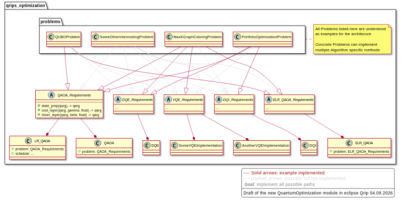

THIS REPO IS WORK IN PROGRESS AT BEST, 
AND IS CURRENTLY ONLY USED AS A PROVE OF CONCEPT! 
BREAKING CHANGES WILL MOST LIKLY ACCURE.

# Quantum Optimization Module (Eclipse Qrisp)

This module provides a flexible architecture for solving optimization problems
with different quantum(-inspired) algorithms. It is designed to:

- Separate **problem definitions** from **algorithm implementations**
- Use **requirements interfaces** to express what an algorithm needs from a problem
- Make it easy to add new problems and new algorithm variants

The UML below summarizes the architecture:



# Core Concepts

## Requirements Interfaces

Each algorithm type declares an abstract requirements interface:
* QAOA_Requirements
* ELR_QAOA_Requirements
* DQE_Requirements
* Bruteforce_Requirements
* ...

Example (QAOA_Requirements):
```python
from abc import ABC, abstractmethod
from qrisp import QuantumVariable, QuantumArray

class QAOA_Requirements(ABC):
    @abstractmethod
    def cl_cost_function(self, x) -> float: 
        """Returns the classical cost of the problem given a assignment vector x"""
        ...

    @abstractmethod
    def state_prep(
        self, 
        qarg: QuantumVariable | QuantumArray
    ) -> QuantumVariable | QuantumArray: 
        """Prepare the initial quantum state."""
        ...

    @abstractmethod
    def cost_layer(
        self, 
        qarg: QuantumVariable | QuantumArray, 
        gamma: float
    ) -> QuantumVariable | QuantumArray: 
        """Apply the cost Hamiltonian layer."""
        ...


    @abstractmethod
    def mixer_layer(
        self, 
        qarg: QuantumVariable | QuantumArray, 
        beta: float
    ) -> QuantumVariable | QuantumArray:        
        """Apply the mixer Hamiltonian layer."""
        ...
```

Algorithms depend only on these requiements, not on concrete problem classes.

## Problems
Problem clalsses live in `qrisp_optimization.problems` and implement one or more requirement interfaces, e.g.:
* MaxKGraphColoringProblem
* PortfolioOptimizationProblem
* QUBOProblem

## Algorithms
Algorithms are classes that consume a problem implementing the matching requirements:
* QAOA(problem: QAOA_Requirements)
* LR_QAOA(problem: QAOA_Requirements)
* ELR_QAOA(problem: ELR_QAOA_Requirements)
* DQE(problem: DQE_Requirements)
* DQI(problem: DQI_Requirements)
* Bruteforce(problem: Bruteforce_Requirements)
* ...

# Usecase 1: Solve an existing problem with an existing algorithm
## Scenario
You have both:
- a **problem class** that is already implemented, e.g. `MaxKGraphColoringProblm`
- an **algorithm** that is already implemented, e.g. `QAOA`

and the problem already implement the algorithms requirements (in this case `QAOA_Requirements`).

## Steps
1. **Choose the problem and algorithm**
```python
from quantum_optimization.problems import MaxKGraphColoringProblem
from quantum_optimization import QAOA
```

2. **Instantiate the problem**
```python
problem = MaxKGraphColoringProblem(graph=my_graph, k=3)
```

3. **Instantiate the algorithm**
```python
algo = QAOA(problem=problem, qarg=...)
```

4. **Run the algorithm**
```python
qarg = algo.ansatz(...)
```

# Usecase 2: Solve a new problem with an existing algorithm

## Scenario
You want to introduce a new problem (e.g. MyFancyRoutingProblem) and solve it with an *existing algorithm*, e.g. QAOA.

## Steps

1. **Check the algorithm's requirements**
    * Identify the requirements interface, e.g. QAOA_Requirements
    * Inspect which methods must be implemented (cl_cost_function, state_prep, cost_layer, mixer_layer, ...)

2. **Implement the problem class that satisfies the requirements**
```python
from quantum_optimization import QAOA_Requirements

class MyFancyRoutingProblem(QAOA_Requirements):
    def __init__(self, data, ...):
        self.data = data
        ...

    def cl_cost_function(self, x) -> float:
        ...

    def state_prep(self, qarg):
        ...
        return qarg

    def cost_layer(self, qarg, gamma: float):
        ...
        return qarg

    def mixer_layer(self, qarg, beta: float):
        ...
        return qarg
```

3. **Instantiate the problem**
```python
problem = MyFancyRoutingProblem(data=my_data, ...)
```

4. **Instantiate the existing algorithm with the new problem**
```python
from quantum_optimization import QAOA

algo = QAOA(problem=problem, params=...)
```

5. **Run the algorithm**
```python
qarg = algo.ansatz(...)
```

# Usecase 3: Solve an existing problem with a new algorithm

## Scenario
You have an **existing problem** (e.g. MaxKGraphColoringProblem), and you want to introduce a **new algorithm**, e.g. GroundbreakingQAOA.

## Steps
1. **Check if the existing requirements are sufficient**
    * Try to reuse the interface of a related algorithm, e.g. QAOA_Requirements
    * If all needed methods are already covered, you can directly depend on that interface

2. **If the existing requirements suffice**
    * Implement the new algorithm class using the existing requirements
    ```python
    from quantum_optimization import QAOA_Requirements

    class GroundbreakingQAOA:
        def __init__(self, problem: QAOA_Requirements, ...):
            self.problem = problem
            ...

        def ansatz(self):
            ...
    ```

    * Use one of the build in problem classes that satisfy the requirements

3. **If the existing requirements do not suffice**
    > In this case you have to do all the work anyway,
    > so you might as well stick to the architecture.

    * Define a new requirements interface, e.g. GroundbreakingQAOA_Requirements
    * Implement or adapt the existing problem to satisfy this new interface
    * Implement the new algorithm depending on this new interface
    * Use the algorithm with any problem that implements the new requirements

# Extensibility
* **Add a new problem**
    * Implement one or more requirement interfaces (QAOA_Requirements, VQE_Requirements, etc.).
    * All algorithms depending on those requirements can immediately use the new problem.

* **Add a new algorithm or variant**
    * Prefer reusing an existing requirements interface.
    * If necessary, introduce a new requirements interface and implement it in compatible problems.

## License

This Repo is intentionally not published under any license,
you may **not** use it at the current stage.

A License will be added at a later point, when development has progressed.